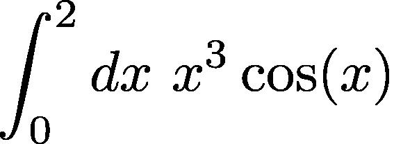

# Laboratorio 8: Metodi Monte Carlo e Simulazione semplice esperimento

Lavoreremo  all'implementazione di tecniche Monte Carlo per la stima di _pigreco_ e di un integrale definito.

Implementiamo poi un semplice programma che genera dei dati "sporcati" da imperfezioni casuali.

Prima di cominciare ci doteremo di tutti gli strumenti necessari alla generazione di numeri casuali....

## Esercizio 1
Stimiamo $\pi$ usando la tecnica Monte Carlo discussa a lezione. Supporremo che il quarto di  circonferenza (nel primo quadrante) _A_ abbia centro nel punto O=(0,0) e raggio unitario. I punti verranno invece sparati a caso nel quadrato _E_ di lato 1 con spigolo in basso a sinistra nell'origine.  Struttureremo la soluzione come segue:

1. La funzione 

__bool inIn(puntoR2 p, double r)__

 che, preso in ingresso un __puntoR2__ (vedi Laboratorio 7) restituisca __true__ se il punto corrispondente cade all'interno di una circonferenza di raggio __r__ centrata nell'orgine, __false__ atrimenti (vedi ancora Laboratorio 7).

2. Definire una funzione 

__int countwithin(int n)__

che, preso in ingresso un valore intero _n_, estragga _n_ punti a caso nel quadrato _E_, e restituisca il numero di punti che cadono all'interno di _A_. A tal fine, la funzione dovrà usare la funzione __isIn__ menzionata al punto precedente.

3. Definire una funzione

__double rilev(int n)__

che preso in ingresso il numero di punti a caso da utilizzare, fornisca una <u>rilevazione</u> di $\pi$ usando la relazione vista a lezione. 

4. Fatto questo, scrivere un programma che fornisca una stima di $\pi$ attraverso _M=50_ rilevazioni, ciascuna delle quali usa _N=100_ punti estratti a caso. Il programma dovrà quindi calcolare la media e la varianza del campione del vettore di rilevazioni. La media del campione sarà  la nostra stima di $\pi$, la varianza invece una misura della qualità  della misura. Cosa succede alla varianza calcolata se invece di 100 punti usassimo 200,300,400,500  punti per ogni rilevazione?

## Esercizio 2
Fornire una stima Monte Carlo dell'integrale, usando, con attenzione, una delle due strategie discusse a lezione.

 
 
 usando M=20 _misure_ ciscuna delle quali usa _k=50_ punti estratti a caso nell'intervallo [0,2]. Calcolare la stima dell'integrale (media delle _M_ misure) e la deviazione standard del campione delle misure. Cosa succede se usiamo _k=100,150,200_ punti per ogni misura? ATTENZIONE: fate riferimento alla vesione aggionrata delle slides, dove un errore (per cui mi scuso) è stato corretto.
 
 ## Esercizio 3

 Scrivere una funzione

 __double rileva(double time, double x0,double v,double u)__

 che, preso in ingresso un tempo __time__ calcoli la posizione  di un punto materiale che si muova secondo la legge

 _x(t) = x0 + v t_

 a cui somma un valore casuale $\epsilon$  estratto a caso nell'intervallo __[-u,u]__. Il valore generato sarà pertanto uguale a 

 _y = x(time)+ $\epsilon$_

 Fissati i valori __x0 = 2, v = 0.3, u = 0.2__, usare la funzione __rileva__ per generare 100 coppie $(t_i,y_i)$ con $t_i = 0.2 * i, i=0,1,\ldots,99$. Registrare le coppie generate su un file dal nome __modo.dat__. Ogni riga del file dovrà contenere una coppia $t_i$ $y_i$, ciascuna registrata in un campo di ampiezza 12. Usare il modificatore __setw(...)__ della libreria __iomanip__.